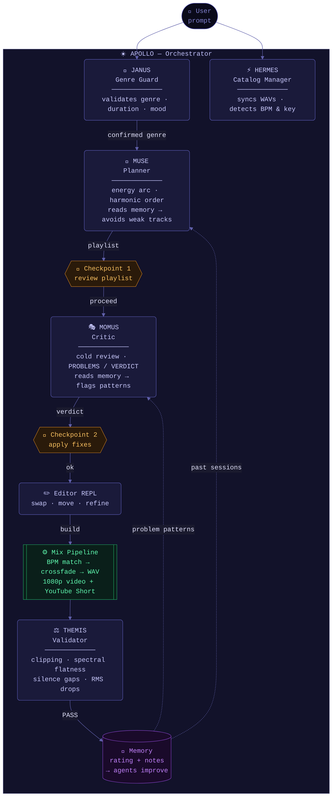

# ApolloAgents


> An AI-powered DJ set builder — from track catalog to rendered YouTube video, guided by a team of specialized agents.

ApolloAgents uses a multi-agent pipeline to plan, critique, and build DJ mixes. You describe the vibe. The agents handle harmonic mixing, BPM matching, energy arc planning, and audio quality validation. You stay in control at every checkpoint.

---

## Architecture



| Agent | Mythological name | Role |
|-------|------------------|------|
| Genre Guard | **Janus** | Gatekeeper — validates genre, duration, mood before planning starts |
| Catalog Manager | **Hermes** | Keeper of records — syncs WAV files to catalog, detects BPM & key |
| Planner | **Muse** | Inspires the set — energy arc, harmonic ordering, track selection |
| Critic | **Momus** | God of fault-finding — cold independent review, structured verdict |
| Validator | **Themis** | Goddess of order — audio quality analysis after every build |
| Orchestrator | **Apollo** | Conductor — sequences all agents, manages state, collects memory |

---

## Features

- **Conversational planning** — describe the vibe, iterate with the agents, build when ready
- **Harmonic mixing** — Camelot wheel-based track ordering for smooth key transitions
- **BPM matching** — gradual tempo ramps between tracks via pyrubberband
- **Audio validation** — peak clipping, spectral flatness (bleach detection), silence gap and RMS anomaly checks
- **Session memory** — agents learn from past sessions: which tracks get swapped, what energy arcs rate highly
- **Catalog management** — scan new WAVs, detect missing BPM/key fields, keep tracks.json in sync
- **1080p video output** — spectral waveform visualizer, beat-reactive particles, DALL-E 3 artwork, retro pixel titles
- **YouTube Short** — auto-generated 20s teaser alongside the full mix

---

## Setup

**Requirements:** Python 3.12+, `uv`, `ffmpeg`

```bash
git clone https://github.com/YOUR_USERNAME/apolloagents.git
cd apolloagents

# Install dependencies
uv sync

# Copy and fill in your API keys
cp .env.example .env
```

**`.env` keys:**

| Key | Required | Purpose |
|-----|----------|---------|
| `ANTHROPIC_API_KEY` | One of these | Claude (recommended) |
| `OPENAI_API_KEY` | One of these | GPT-4o — also used for DALL-E 3 artwork |

---

## Adding Your Tracks

Put WAV files into genre subfolders under `tracks/`:

```
tracks/
  techno/
    Acid Rain.wav
    Zero Day.wav
  deep house/
    Solar Drift.wav
  lofi - ambient/
    Kernel Space.wav
  cyberpunk/
    Chrome Horizon.wav
```

Then build the catalog (detects BPM + Camelot key for each file):

```bash
python main.py --build-catalog
```

Or let **Hermes** do it conversationally:

```bash
uv run python agent/run.py
# → "I added new tracks"
```

---

## Usage

### Conversational agent (recommended)

```bash
uv run python agent/run.py
```

Example session:
```
What would you like to do?

You: 60min techno set, dark industrial build to a hard peak

── Janus (Genre Guard) ──
[confirms genre: techno, 60min, mood: dark industrial build]

── Muse (Planner) ──
[proposes 12-track playlist with energy arc rationale]

── Checkpoint 1 ──
You: move track 4 to position 7
[shows updated playlist]
You: proceed

── Momus (Critic) ──
PROBLEMS:
- [pos 2→3] key clash 5A → 11A — fix: swap pos 3 for zero-day
VERDICT: NEEDS_FIXES

── Checkpoint 2 ──
You: swap pos 3 like the critic said
You: ok

── Editor ──
You: build midnight-industrial

── Themis (Validator) ──
AUDIO QUALITY REPORT — midnight-industrial
Status: PASS — no issues detected ✓

Rate 1-5 (Enter to skip): 5
Any notes?: peak section was perfect
```

### Direct CLI (no agent)

```bash
# Generate a session directly
python main.py --name "midnight-techno" --genre "techno" --duration 60

# Re-render video from existing mix audio
python main.py --name "midnight-techno" --genre "techno" --video-only

# Fix missing BPM/key fields in catalog
python main.py --fix-incomplete
```

---

## Supported Genres

| Folder name | Visual theme |
|-------------|-------------|
| `techno` | Dark red, industrial |
| `deep house` | Neon violet, deep |
| `lofi - ambient` | Warm cream, anime-style artwork |
| `cyberpunk` | Neon green, dystopic |

Add new genres by creating a subfolder under `tracks/` and running `--build-catalog`.

---

## Output

Every session writes to `output/<session-name>/`:

```
output/midnight-techno/
  mix_output.wav      # lossless mix
  mix_video.mp4       # 1920×1080, 24fps, spectral waveform
  short.mp4           # 1080×1920, 20s YouTube Short
  session.json        # playlist for reproducibility
  transitions.json    # crossfade timestamps
  youtube.md          # title, description, tracklist, tags
```

---

## Agent Memory

After each build, rate your session 1-5. Ratings accumulate in `agent/memory.json`. On the next session of the same genre:

- **Muse (Planner)** avoids tracks that have been swapped out 2+ times
- **Momus (Critic)** flags transition patterns that have been problems before
- High-rated mood/arc combinations are surfaced as references

---

## Project Structure

```
main.py              # Core pipeline (~2600 lines): catalog, mixing, video
agent/
  run.py             # Apollo orchestrator + all agent loops
  tools.py           # Tool functions for all agents
  memory.json        # Persistent session history (auto-created)
tracks/
  tracks.json        # Unified catalog (auto-generated)
  <genre>/           # WAV files per genre
output/              # Generated mixes and videos (gitignored)
artwork/             # DALL-E 3 backgrounds (cached, gitignored)
fonts/
  PressStart2P-Regular.ttf
```

---

## License

MIT — see [LICENSE](LICENSE)
